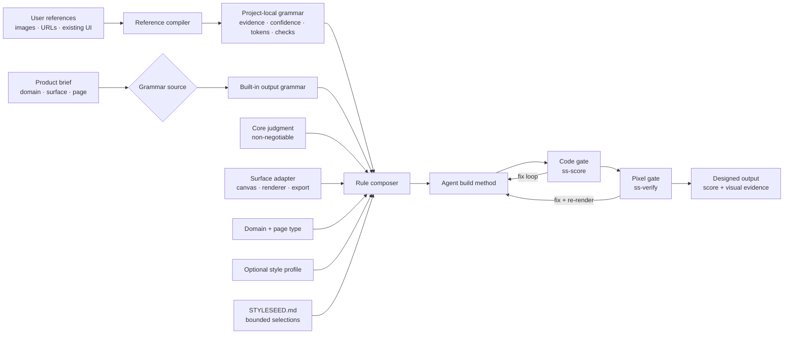

# StyleSeed Engine Architecture

StyleSeed converts product intent and visual evidence into an enforceable design method for
coding agents. The architecture separates **fixed judgment**, **task-specific grammar**, and
**project-specific choices** so consistency does not collapse into one universal aesthetic.


## System flow



## Layers and authority

| Layer | Responsibility | May change | May not change |
|---|---|---|---|
| Product constitution | Stable design judgment | maintained invariants | per-project aesthetics |
| Output grammar | Organize attention and action for an output class | bounded twelve-axis contract | accessibility or core coherence |
| Surface adapter | Translate method into an artifact/render contract | canvas, safe zones, export, surface QA | visual authority or product judgment |
| Reference compiler | Derive a local grammar from evidence | local rules with confidence | global built-ins or protected assets |
| Domain + page playbooks | Contextual composition bias | content/order/detail decisions | grammar identity |
| Aesthetic profile | Coordinated look adjustment | radius, density, tone, motion within bounds | task structure |
| Design lock | Persist selected values | known enums and project tokens | invent exceptions or waive rules |
| Build skills | Apply the composed method | implementation | self-certify without evidence |
| Score + verify | Detect code and pixel drift | fixes needed to comply | redefine the chosen method |

## Grammar sources

### Built-in

Maintained in `RULESETS.md`. Built-ins require independent evidence, counterexamples, rendered
samples, and regression coverage. They are selected by output job: consumer service,
operations console, technical instrument, editorial reading, commerce conversion,
institutional service, or expressive marketing.

### Reference-compiled

`/ss-reference` runs `REFERENCE-COMPILER.md`. It ingests user references, fills the same
twelve-axis schema, cites evidence and confidence, and writes a project-local grammar under
`.styleseed/rulesets/`. A transfer screen proves that the result is a reusable language rather
than a clone of one source screen.

## Runtime composition

The rule composer resolves conflicts by authority, then hands one effective rule set to the
agent:

```text
effectiveRules = constrain(
  coreJudgment,
  outputGrammar,
  surfaceAdapter,
  domainPlaybook,
  pageType,
  optionalStyleProfile,
  boundedDesignLock
)
```

The design lock stores selections; it is not executable policy. A value outside the grammar's
range is rejected or replaced by the nearest safe fallback.

## Non-web outputs

`ADAPTERS.md` lets the same method drive product UI, social carousels, slide decks, documents,
and single-frame graphics. The companion renderer owns physical production constraints. For
example, StyleSeed supplies the `sequential-story` grammar and brand system while the Claude
`carousel-build` skill owns Instagram canvas, safe zones, crop, PIL rendering, and export QA.

## Verification model

StyleSeed uses two auxiliary gates because source correctness and rendered quality fail in
different ways:

- `ss-score` reads implementation evidence: tokens, hierarchy, states, semantics, coherence,
  and characteristic grammar tells.
- `ss-verify` renders the result and checks pixels: actual focal dominance, type loading,
  balance, optical rhythm, responsive behavior, and state rendering.

Both gates return to the build loop. Neither gate is the design engine; the composed method is.

## Extension boundary

- Add a new built-in grammar only after the promotion rule in `RULESETS.md` passes.
- Use `/ss-reference` for project-specific or emerging languages.
- Add a new aesthetic profile only when it is a full coordinated axis contract, not a mood word.
- Keep components and skins downstream. They implement a decision; they do not decide.
