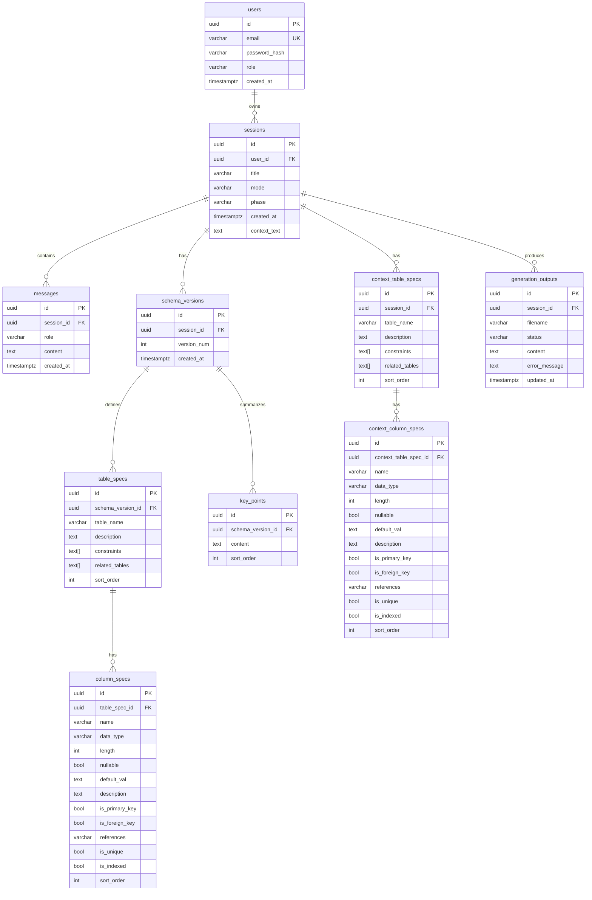

# SQL Agent — 資料庫設計文件

> **現況（v0.5）**：資料以 `data/<uuid>.json` 檔案儲存，使用 `threading.Lock` 保護並發存取。  
> 本文件定義 **v1.0 目標的 PostgreSQL schema**，作為未來遷移的依據。

---

## 一、ER Diagram



---

## 二、PostgreSQL DDL

```sql
-- Enable UUID generation
CREATE EXTENSION IF NOT EXISTS "pgcrypto";

-- ── Users ──────────────────────────────────────────────
CREATE TABLE users (
    id             UUID PRIMARY KEY DEFAULT gen_random_uuid(),
    email          VARCHAR(320) NOT NULL,
    password_hash  VARCHAR(255) NOT NULL,
    role           VARCHAR(20)  NOT NULL DEFAULT 'user'
                   CHECK (role IN ('user', 'admin')),
    created_at     TIMESTAMPTZ  NOT NULL DEFAULT NOW(),
    CONSTRAINT uq_users_email UNIQUE (email)
);

-- ── Sessions ───────────────────────────────────────────
CREATE TABLE sessions (
    id           UUID PRIMARY KEY DEFAULT gen_random_uuid(),
    user_id      UUID         REFERENCES users(id) ON DELETE SET NULL,
    title        VARCHAR(200) NOT NULL DEFAULT '未命名設計',
    mode         VARCHAR(10)  NOT NULL DEFAULT 'design'
                 CHECK (mode IN ('design', 'review')),
    phase        VARCHAR(20)  NOT NULL DEFAULT 'collecting'
                 CHECK (phase IN (
                     'collecting', 'confirming', 'generating', 'done',
                     'reviewing', 'review_done'
                 )),
    created_at   TIMESTAMPTZ  NOT NULL DEFAULT NOW(),
    context_text TEXT         NOT NULL DEFAULT ''
);

CREATE INDEX idx_sessions_user_id    ON sessions (user_id);
CREATE INDEX idx_sessions_created_at ON sessions (created_at DESC);
CREATE INDEX idx_sessions_phase      ON sessions (phase);

-- ── Messages ───────────────────────────────────────────
CREATE TABLE messages (
    id          UUID PRIMARY KEY DEFAULT gen_random_uuid(),
    session_id  UUID        NOT NULL REFERENCES sessions(id) ON DELETE CASCADE,
    role        VARCHAR(5)  NOT NULL CHECK (role IN ('user', 'ai')),
    content     TEXT        NOT NULL,
    created_at  TIMESTAMPTZ NOT NULL DEFAULT NOW()
);

CREATE INDEX idx_messages_session_id ON messages (session_id, created_at);

-- ── Schema versions ────────────────────────────────────
-- Each AI-generated schema snapshot; max 10 per session enforced at app level.
CREATE TABLE schema_versions (
    id           UUID PRIMARY KEY DEFAULT gen_random_uuid(),
    session_id   UUID        NOT NULL REFERENCES sessions(id) ON DELETE CASCADE,
    version_num  INT         NOT NULL,
    created_at   TIMESTAMPTZ NOT NULL DEFAULT NOW(),
    CONSTRAINT uq_schema_version UNIQUE (session_id, version_num)
);

CREATE INDEX idx_schema_versions_session_id ON schema_versions (session_id, version_num DESC);

-- ── Key points (requirements summary per version) ──────
CREATE TABLE key_points (
    id                UUID PRIMARY KEY DEFAULT gen_random_uuid(),
    schema_version_id UUID NOT NULL REFERENCES schema_versions(id) ON DELETE CASCADE,
    content           TEXT NOT NULL,
    sort_order        INT  NOT NULL DEFAULT 0
);

-- ── Table specs (per schema version) ──────────────────
CREATE TABLE table_specs (
    id                UUID PRIMARY KEY DEFAULT gen_random_uuid(),
    schema_version_id UUID         NOT NULL REFERENCES schema_versions(id) ON DELETE CASCADE,
    table_name        VARCHAR(63)  NOT NULL,
    description       TEXT         NOT NULL DEFAULT '',
    constraints       TEXT[]       NOT NULL DEFAULT '{}',
    related_tables    TEXT[]       NOT NULL DEFAULT '{}',
    sort_order        INT          NOT NULL DEFAULT 0
);

CREATE INDEX idx_table_specs_version_id ON table_specs (schema_version_id);

-- ── Column specs ───────────────────────────────────────
CREATE TABLE column_specs (
    id              UUID PRIMARY KEY DEFAULT gen_random_uuid(),
    table_spec_id   UUID         NOT NULL REFERENCES table_specs(id) ON DELETE CASCADE,
    name            VARCHAR(63)  NOT NULL,
    data_type       VARCHAR(50)  NOT NULL,
    length          INT,
    nullable        BOOLEAN      NOT NULL DEFAULT TRUE,
    default_val     TEXT,
    description     TEXT         NOT NULL DEFAULT '',
    is_primary_key  BOOLEAN      NOT NULL DEFAULT FALSE,
    is_foreign_key  BOOLEAN      NOT NULL DEFAULT FALSE,
    references      VARCHAR(128),
    is_unique       BOOLEAN      NOT NULL DEFAULT FALSE,
    is_indexed      BOOLEAN      NOT NULL DEFAULT FALSE,
    sort_order      INT          NOT NULL DEFAULT 0
);

CREATE INDEX idx_column_specs_table_spec_id ON column_specs (table_spec_id);

-- ── Context table specs (imported existing DB) ─────────
CREATE TABLE context_table_specs (
    id          UUID PRIMARY KEY DEFAULT gen_random_uuid(),
    session_id  UUID         NOT NULL REFERENCES sessions(id) ON DELETE CASCADE,
    table_name  VARCHAR(63)  NOT NULL,
    description TEXT         NOT NULL DEFAULT '',
    constraints TEXT[]       NOT NULL DEFAULT '{}',
    related_tables TEXT[]    NOT NULL DEFAULT '{}',
    sort_order  INT          NOT NULL DEFAULT 0
);

CREATE INDEX idx_context_table_specs_session_id ON context_table_specs (session_id);

-- ── Context column specs ───────────────────────────────
CREATE TABLE context_column_specs (
    id                      UUID PRIMARY KEY DEFAULT gen_random_uuid(),
    context_table_spec_id   UUID         NOT NULL
                            REFERENCES context_table_specs(id) ON DELETE CASCADE,
    name                    VARCHAR(63)  NOT NULL,
    data_type               VARCHAR(50)  NOT NULL,
    length                  INT,
    nullable                BOOLEAN      NOT NULL DEFAULT TRUE,
    default_val             TEXT,
    description             TEXT         NOT NULL DEFAULT '',
    is_primary_key          BOOLEAN      NOT NULL DEFAULT FALSE,
    is_foreign_key          BOOLEAN      NOT NULL DEFAULT FALSE,
    references              VARCHAR(128),
    is_unique               BOOLEAN      NOT NULL DEFAULT FALSE,
    is_indexed              BOOLEAN      NOT NULL DEFAULT FALSE,
    sort_order              INT          NOT NULL DEFAULT 0
);

-- ── Generation outputs ─────────────────────────────────
CREATE TABLE generation_outputs (
    id            UUID PRIMARY KEY DEFAULT gen_random_uuid(),
    session_id    UUID         NOT NULL REFERENCES sessions(id) ON DELETE CASCADE,
    filename      VARCHAR(100) NOT NULL,
    status        VARCHAR(10)  NOT NULL DEFAULT 'waiting'
                  CHECK (status IN ('waiting', 'loading', 'done', 'failed')),
    content       TEXT,
    error_message TEXT,
    updated_at    TIMESTAMPTZ  NOT NULL DEFAULT NOW(),
    CONSTRAINT uq_generation_output UNIQUE (session_id, filename)
);

CREATE INDEX idx_generation_outputs_session_id ON generation_outputs (session_id);
```

---

## 三、JSON → PostgreSQL 欄位對照表

| JSON 欄位（`data/*.json`） | 目標資料表 | 欄位 | 備註 |
|---|---|---|---|
| `id` | `sessions` | `id` | UUID，已為 UUID 格式 |
| `title` | `sessions` | `title` | |
| `mode` | `sessions` | `mode` | |
| `phase` | `sessions` | `phase` | |
| `created_at` | `sessions` | `created_at` | |
| `context_text` | `sessions` | `context_text` | |
| `messages[]` | `messages` | 多列 | `role` + `content` |
| `tables[]` (當前版本) | `schema_versions` + `table_specs` + `column_specs` | 正規化 | |
| `key_points[]` (當前版本) | `key_points` | 多列 | 關聯至最新 schema_version |
| `table_versions[]` | `schema_versions` + 子表 | 正規化 | 最多 10 版 |
| `context_tables[]` | `context_table_specs` + `context_column_specs` | 正規化 | |
| `outputs{}` | `generation_outputs` | `filename`+`content` | |
| `generation_status{}` | `generation_outputs` | `status` | |
| `generation_errors{}` | `generation_outputs` | `error_message` | |

---

## 四、遷移策略（JSON → PostgreSQL）

遷移工具建議使用 **SQLAlchemy 2.x + Alembic**。

```
遷移步驟：
1. 建立 PostgreSQL schema（上方 DDL）
2. 逐一讀取 data/*.json 檔
3. 插入 sessions、messages、schema_versions 等
4. 最後一個 table_versions 項目 → 插入 schema_versions + 子表
5. 當前 tables/key_points → 也插入一筆 schema_version（標記為 current）
6. 驗證：筆數一致，再切換 app.py 讀寫層
```

> 本遷移屬 Phase 4（認證與部署）範疇，需先完成 SQLAlchemy 模型設計。
