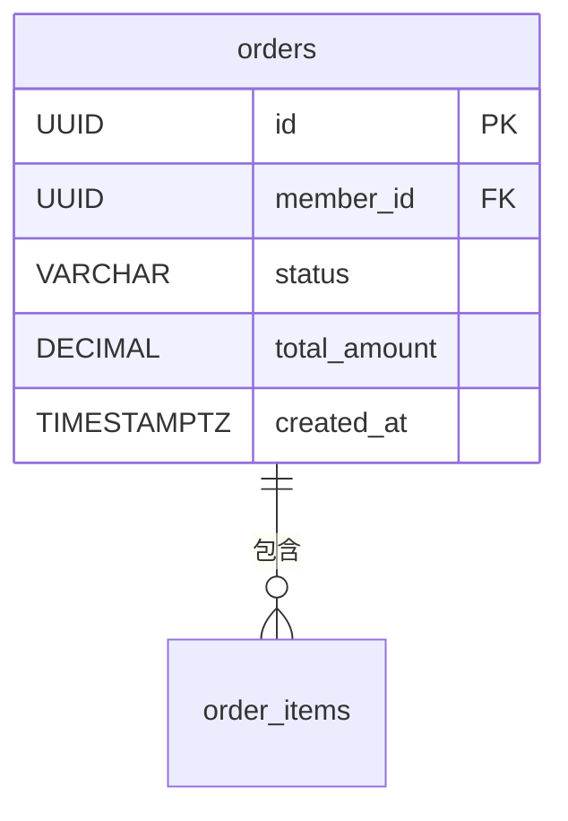

# SQL Agent 平台設計規格書

## 提供給設計方的說明文件

---

## 一、產品背景

### 這是什麼

**SQL Agent** 是一個 AI 驅動的資料庫建檔管理工具。使用者透過自然語言對話描述資料表需求，AI 會主動追問缺漏細節，確認完整後自動產出四份技術文件。

### 目前狀態

已有可運作的 Python CLI 版本（終端機命令列介面）。現在需要建立一個**網頁平台**，讓非技術使用者也能輕鬆操作，並管理過去產出的文件。

### 核心價值

- 不需要懂 SQL，用說的就能建立完整的資料庫設計文件
- 取代人工撰寫規格書的繁瑣過程
- 產出標準化、可直接使用的技術文件

---

## 二、使用者

### 主要使用者

| 角色 | 需求 | 技術背景 |
|---|---|---|
| 系統分析師 / SA | 快速產出資料庫規格書供開發參考 | 中等 |
| 專案經理 / PM | 整理需求後交給開發，不需手寫 SQL | 低 |
| 後端開發者 | 快速建立新功能的資料表設計草稿 | 高 |

### 使用情境

1. **新專案啟動**：需要設計多個資料表，逐一透過 Agent 完成
2. **功能擴充**：單一新資料表的需求，快速完成文件
3. **文件補建**：既有系統缺少規格書，補建歸檔

---

## 三、完整使用流程

平台的核心流程分為三個階段：

```
[建立對話] → [需求收集對話] → [確認需求] → [產出文件] → [查閱 / 下載]
```

### 階段 1：需求收集（對話模式）

使用者輸入需求描述，AI 進行多輪追問：

```
使用者：我想建一個訂單系統，有訂單主表和訂單明細

AI    ：好的！先確認訂單主表：
        1. 主鍵設計：UUID 還是自增 ID？
        2. 訂單和哪個表有關聯？（例如會員表）

使用者：UUID 主鍵，關聯會員表，要記錄訂單狀態

AI    ：了解，還需確認：
        1. 訂單狀態有哪些值？（如 pending / paid / shipped / cancelled）
        2. 是否需要 created_at / updated_at 時間戳？
```

AI 判斷需求完整後，自動切換到確認畫面。

### 階段 2：需求確認（摘要表格）

顯示收集到的結構化摘要，讓使用者審閱：

```
┌── orders（訂單主表）────────────────────────────┐
│ 欄位         │ 型態        │ NULL │ 說明          │
│ id           │ UUID        │ 否   │ PK            │
│ member_id    │ UUID        │ 否   │ FK→members.id │
│ status       │ VARCHAR(20) │ 否   │ 訂單狀態      │
│ total_amount │ DECIMAL     │ 否   │ 訂單總金額    │
│ created_at   │ TIMESTAMPTZ │ 否   │               │
└──────────────────────────────────────────────────┘
```

使用者選擇：**「確認，產出文件」** 或 **「繼續修改」**

### 階段 3：文件產出與查閱

確認後系統產出四份文件，可在頁面上直接預覽或下載：

| 文件 | 說明 |
|---|---|
| 📄 規格書與資料字典 | 完整欄位定義表格（Markdown） |
| 🗺 結構與關聯圖 | Mermaid ER Diagram（可即時渲染） |
| 💾 DDL 腳本 | PostgreSQL CREATE TABLE + Migration + Seed |
| 🔒 效能與安全規劃 | 索引建議、存取控制、敏感欄位處理 |

---

## 四、頁面結構

### 4-1 首頁 / 工作台

**功能：** 建立新對話、查閱歷史紀錄

```
┌──────────────────────────────────────────────────────┐
│  SQL Agent                              [登入帳號]    │
├──────────────────────────────────────────────────────┤
│                                                      │
│  [＋ 開始新的資料表設計]                              │
│                                                      │
│  最近的紀錄                                          │
│  ┌─────────────────────────────────────────────────┐ │
│  │ 📁 訂單系統設計          2026/05/25  [查看文件] │ │
│  │ 📁 會員管理資料表         2026/05/20  [查看文件] │ │
│  │ 📁 庫存管理系統           2026/05/15  [查看文件] │ │
│  └─────────────────────────────────────────────────┘ │
└──────────────────────────────────────────────────────┘
```

---

### 4-2 對話頁面（主要操作頁）

**功能：** 與 AI 進行需求收集對話

```
┌──────────────────────────────────────────────────────┐
│  ← 返回   訂單系統設計（進行中）           [階段 1/3] │
├─────────────────────────────────┬────────────────────┤
│                                 │                    │
│  對話區                          │  目前收集進度      │
│                                 │  ─────────────     │
│  AI  好的！先確認訂單主表：     │  ✓ orders          │
│      1. 主鍵設計？              │    - id (PK)       │
│      2. 關聯哪個表？            │    - member_id     │
│                                 │    - status        │
│  您  UUID，關聯會員表           │    - ...           │
│                                 │                    │
│  AI  了解！還需確認：           │  ○ order_items     │
│      1. 狀態有哪些值？          │    待收集          │
│      2. 需要時間戳嗎？          │                    │
│                                 │                    │
│  ┌────────────────────────────┐ │                    │
│  │ 輸入訊息...            [送出] │                    │
│  └────────────────────────────┘ │                    │
└─────────────────────────────────┴────────────────────┘
```

**互動細節：**
- AI 訊息用不同底色區分（左側，灰底）
- 使用者訊息靠右顯示（藍底）
- 右側進度欄即時更新已收集的欄位
- 送出按鈕 / `Enter` 送出，`Shift+Enter` 換行

---

### 4-3 需求確認頁面

**功能：** 審閱 AI 整理的摘要，確認或修改

```
┌──────────────────────────────────────────────────────┐
│  ← 返回修改     需求確認                  [階段 2/3] │
├──────────────────────────────────────────────────────┤
│                                                      │
│  AI 已完成需求收集，請確認以下設計是否正確：          │
│                                                      │
│  ┌── orders（訂單主表）───────────────────────────┐  │
│  │ 欄位         │ 型態    │NULL│說明              │  │
│  │ id           │ UUID    │ 否  │主鍵              │  │
│  │ member_id    │ UUID    │ 否  │FK→members.id    │  │
│  │ status       │VARCHAR  │ 否  │pending/paid/... │  │
│  │ total_amount │DECIMAL  │ 否  │訂單總金額        │  │
│  │ created_at   │TIMESTAMP│ 否  │建立時間          │  │
│  └────────────────────────────────────────────────┘  │
│                                                      │
│  ┌── order_items（訂單明細）──────────────────────┐  │
│  │ ...                                            │  │
│  └────────────────────────────────────────────────┘  │
│                                                      │
│       [← 返回修改需求]    [✓ 確認，開始產出文件]      │
│                                                      │
└──────────────────────────────────────────────────────┘
```

---

### 4-4 文件查閱頁面

**功能：** 預覽與下載四份產出文件

```
┌──────────────────────────────────────────────────────┐
│  訂單系統設計   文件產出完成 ✓          2026/05/26   │
├──────────────────────────────────────────────────────┤
│                                                      │
│  [📄 規格書] [🗺 關聯圖] [💾 DDL] [🔒 安全規劃]      │
│                                    [⬇ 全部下載 .zip] │
├──────────────────────────────────────────────────────┤
│                                                      │
│  # 資料庫規格書與資料字典                             │
│                                                      │
│  ## 資料表：orders                                   │
│  | 欄位名稱 | 資料型態 | 長度 | NULL | 說明 |        │
│  |---------|---------|------|------|-----|          │
│  | id      | UUID    |      | 否   | PK  |          │
│  | ...     | ...     | ...  | ...  | ... |          │
│                                                      │
│  （Mermaid 圖表頁籤則直接渲染為圖形）                 │
│                                                      │
└──────────────────────────────────────────────────────┘
```

**功能細節：**
- 四個頁籤切換，各自顯示對應文件
- 關聯圖頁籤：Mermaid 語法直接渲染為圖形（可縮放）
- DDL 頁籤：程式碼高亮顯示，支援一鍵複製
- 全部下載：打包為 `.zip`，包含四個原始檔案
- 分享連結：產生可分享的唯讀檢視連結

---

## 五、關鍵 UI 狀態

### 對話頁面的三種狀態

| 狀態 | 說明 | UI 表現 |
|---|---|---|
| AI 思考中 | 等待 API 回應 | 輸入框 disabled，顯示 loading 動畫 |
| 需求收集中 | 正常追問對話 | 一般對話介面 |
| 需求收集完成 | AI 已整理出完整摘要 | 自動導向確認頁面，或顯示確認橫幅 |

### 文件產出的四種狀態

| 狀態 | 說明 |
|---|---|
| 等待中 | 尚未觸發產出 |
| 產出中 | 顯示四個文件逐一完成的進度（✓ 規格書 → ✓ 關聯圖 → ...）|
| 完成 | 可預覽與下載 |
| 部分失敗 | 某文件 API 無回應，顯示警告並提供重試按鈕 |

---

## 六、後端 API 界接說明

平台前端需要與 Python Agent 後端溝通。建議後端提供以下 API：

### RESTful 端點

| 方法 | 路徑 | 說明 |
|---|---|---|
| `POST` | `/sessions` | 建立新對話 session |
| `GET` | `/sessions` | 列出歷史 session |
| `GET` | `/sessions/{id}` | 取得單一 session 狀態 |
| `POST` | `/sessions/{id}/messages` | 送出訊息，取得 AI 回覆 |
| `POST` | `/sessions/{id}/confirm` | 使用者確認，觸發文件產出 |
| `GET` | `/sessions/{id}/outputs` | 取得四份文件內容 |
| `GET` | `/sessions/{id}/outputs/zip` | 下載全部文件 zip |

### 回覆格式（送出訊息）

```json
{
  "reply": "了解！還需確認幾點：...",
  "phase": "collecting",
  "tables_ready": false,
  "tables": null
}
```

當 `tables_ready: true` 時，前端自動切換至確認頁面。

---

## 七、設計風格建議

- **整體風格**：專業、簡潔，適合企業內部工具
- **色調**：深藍／灰白為主，強調色用藍綠（技術感）
- **字型**：正文使用系統字體，程式碼區塊使用等寬字體（如 JetBrains Mono）
- **響應式**：以桌面版（1280px+）為主，可不考慮手機版
- **密度**：資訊密度中等，資料表格要能清楚顯示多個欄位

---

## 八、目前 CLI 輸出範例（供參考）

### 規格書（01_specification.md）

```markdown
# 資料庫規格書與資料字典

## 資料表：`orders`
**說明**：訂單主表

| 欄位名稱 | 資料型態 | 長度 | 允許 NULL | 預設值 | PK | FK | UNIQUE | INDEX | 說明 |
|---------|---------|------|---------|-------|----|----|-------|------|-----|
| `id` | UUID | | 否 | gen_random_uuid() | ✓ | | | | 訂單唯一識別碼 |
```

### 關聯圖（02_er_diagram.md）

````markdown

````

### DDL（03_ddl.sql）

```sql
CREATE TABLE orders (
    id UUID PRIMARY KEY DEFAULT gen_random_uuid(),
    member_id UUID NOT NULL REFERENCES members(id),
    status VARCHAR(20) NOT NULL DEFAULT 'pending',
    total_amount DECIMAL(12,2) NOT NULL,
    created_at TIMESTAMPTZ NOT NULL DEFAULT NOW()
);
```

---

## 九、未來可擴充功能（非本次範圍）

- 多人協作同一個 session
- 版本控制（記錄每次修改的 diff）
- 直接連線資料庫執行 DDL
- 範本庫（常用資料表設計可儲存為範本）
- 匯出 Word / PDF 格式
