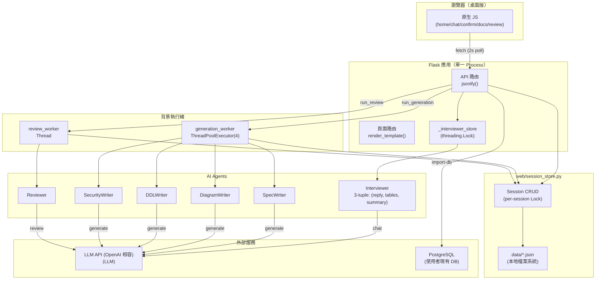
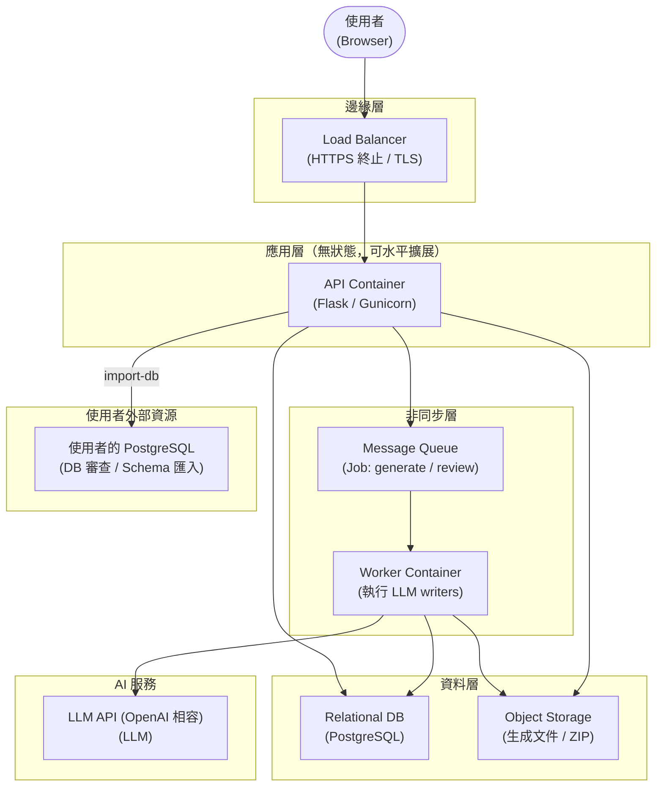

# SQL Agent — 系統架構文件

## 一、現行架構（v0.5）

### 元件圖



### 現行架構限制

| 問題 | 影響 |
|---|---|
| JSON 檔案替代資料庫 | 無交易、無 schema 約束、並發只靠 Lock |
| 單一 Process（Flask dev server） | 無法水平擴展，生成 job 佔用 API worker |
| 2 秒輪詢替代推播 | 不必要的請求，高延遲感知 |
| 無認證機制 | 任何人持 UUID 即可讀寫任意 session |
| print() 取代結構化 log | 無可觀測性 |
| 生成 job 在 Thread 中執行 | API 重啟會中斷進行中的生成作業 |

---

## 二、目標架構（v1.0，Cloud-agnostic）

### 元件圖



### 廠商無關對照表

| 抽象層 | AWS | GCP | Azure | 自架 |
|---|---|---|---|---|
| **Load Balancer** | ALB | GLB | Azure Front Door | Nginx |
| **API Compute** | ECS Fargate | Cloud Run | Container Apps | Docker + K8s |
| **Worker Compute** | ECS Fargate | Cloud Run Jobs | Container Apps | Docker + K8s |
| **Message Queue** | SQS | Pub/Sub | Service Bus | Redis (Celery) |
| **Relational DB** | RDS PostgreSQL | Cloud SQL PG | Azure Database PG | PostgreSQL |
| **Object Storage** | S3 | GCS | Azure Blob | MinIO |
| **Secret Management** | Secrets Manager | Secret Manager | Key Vault | Vault |

---

## 三、Request 生命週期

### 設計模式（對話 + 文件產出）

```
Browser                    API Container              Queue / Worker
   │                            │                          │
   │──POST /api/sessions ──────►│                          │
   │◄─── 201 {session_id} ──────│                          │
   │                            │                          │
   │──POST /messages ──────────►│── Interviewer.chat() ──► LLM
   │◄─── 200 {reply} ───────────│◄── (reply, tables) ──────│
   │                            │                          │
   │  [repeat until tables_ready]                          │
   │                            │                          │
   │──POST /confirm ───────────►│── enqueue(generate_job) ►│
   │◄─── 200 {generating} ──────│                          │── SpecWriter ──► LLM
   │                            │                          │── DiagramWriter ─► LLM
   │──GET /outputs (poll) ──────►│                          │── DDLWriter ───► LLM
   │◄─── 200 {status:loading} ──│                          │── SecurityWriter ► LLM
   │  [poll every 2s]           │                          │
   │──GET /outputs (poll) ──────►│◄── notify complete ──────│
   │◄─── 200 {status:done} ─────│                          │
```

### 審查模式

```
Browser                    API Container         Worker
   │                            │                    │
   │──POST /api/sessions ──────►│── extract_schema ──► UserDB
   │                            │── enqueue(review) ►│
   │◄─── 201 {reviewing} ───────│                    │── Reviewer ──► LLM
   │                            │                    │
   │──GET /outputs (poll) ──────►│◄── notify done ────│
   │◄─── 200 {05_review_report}─│                    │
```

---

## 四、現行 vs 目標架構對比

| 面向 | 現行（v0.5） | 目標（v1.0） |
|---|---|---|
| **持久化** | JSON 檔案 + threading.Lock | PostgreSQL + ORM (SQLAlchemy) |
| **認證** | 無 | JWT Bearer Token |
| **生成 Job** | Thread（同一 Process） | Message Queue + Worker Container |
| **推播** | 2 秒輪詢 | （可選）SSE 或 WebSocket |
| **日誌** | print() | 結構化 JSON log (Python logging) |
| **文件儲存** | session JSON 內嵌字串 | Object Storage |
| **部署** | 單一 python app.py | Docker + Load Balancer + Auto-scale |
| **CI/CD** | 無 | GitHub Actions |
| **可觀測性** | 無 | 結構化 log + health endpoint |

---

## 五、模組依賴圖

```
app.py
├── web/session_store.py     Session CRUD + Lock
├── web/generation_worker.py ThreadPoolExecutor wrapper
├── web/schema_diff.py       compute_diff(designed, existing)
├── web/db_introspect.py     extract_schema(), format_context()
├── web/schemas.py           Pydantic request/response models (doc only)
├── agents/interviewer.py    Interviewer.chat() → (reply, tables, summary)
├── agents/reviewer.py       Reviewer.review() → markdown report
└── agents/writers/
    ├── spec_writer.py        01_specification.md
    ├── diagram_writer.py     02_er_diagram.md
    ├── ddl_writer.py         03_ddl.sql
    └── security_writer.py    04_security_plan.md
```
