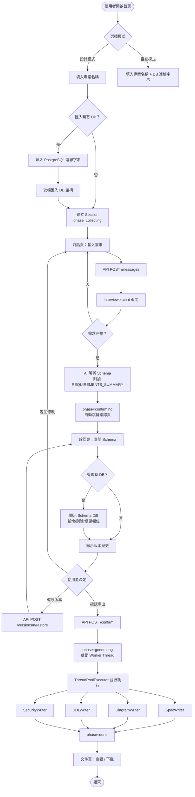
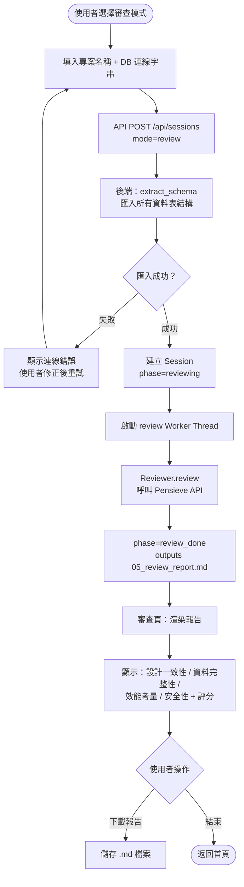
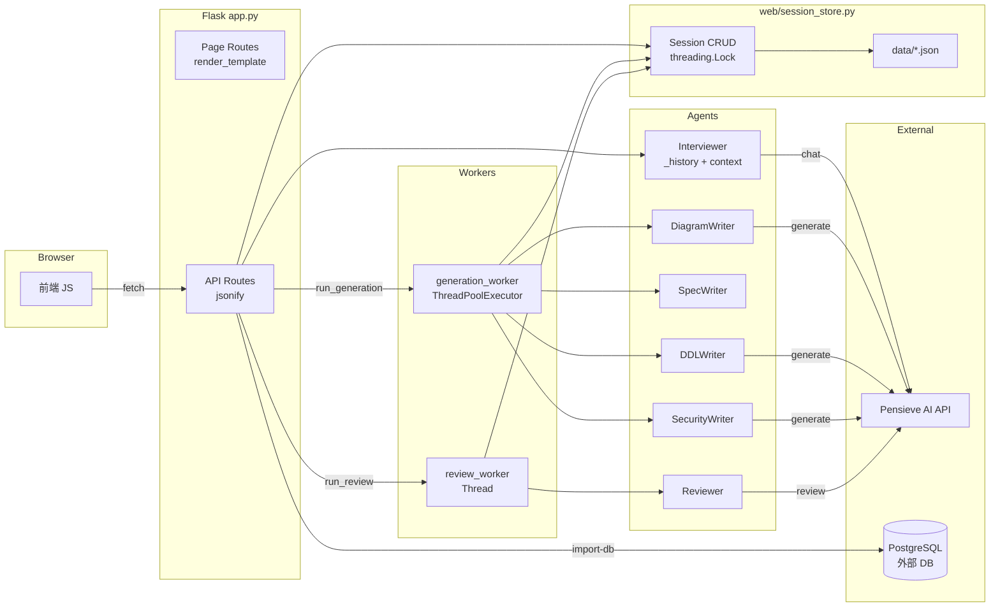
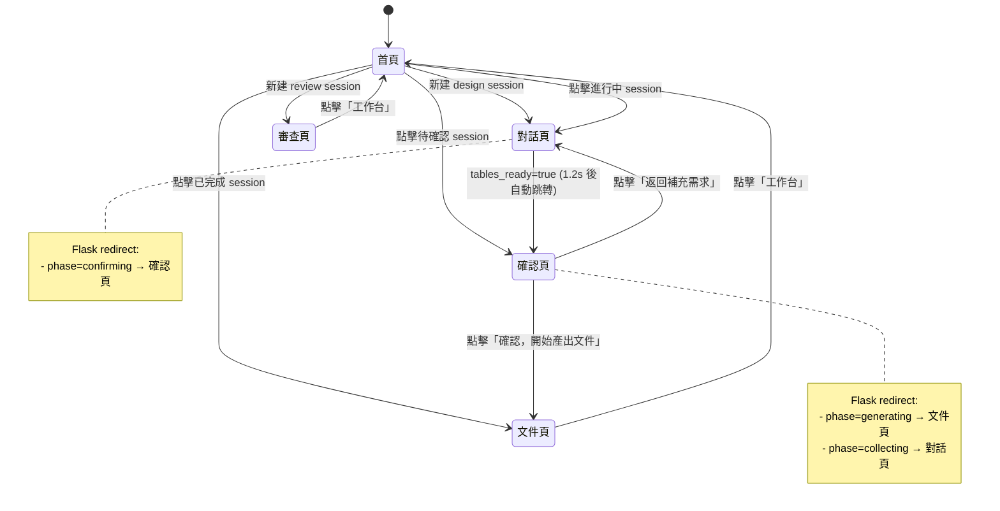

# SQL Agent — 工作流程圖

## 一、設計模式主流程

```mermaid
flowchart TD
    A([使用者開啟首頁]) --> B{選擇模式}
    B -->|設計模式| C[填入專案名稱]
    B -->|審查模式| R1[填入專案名稱 + DB 連線字串]

    C --> C1{匯入現有 DB？}
    C1 -->|是| C2[填入 PostgreSQL 連線字串]
    C2 --> C3[後端匯入 DB 結構]
    C1 -->|否| D
    C3 --> D

    D[建立 Session\nphase=collecting] --> E[對話頁：輸入需求]
    E --> F[API POST /messages]
    F --> G[Interviewer.chat 追問]
    G --> H{需求完整？}
    H -->|否| E
    H -->|是| I[AI 解析 Schema\n附加 REQUIREMENTS_SUMMARY]
    I --> J[phase=confirming\n自動跳轉確認頁]

    J --> K[確認頁：審閱 Schema]
    K --> L{有現有 DB？}
    L -->|是| M[顯示 Schema Diff\n新增/刪除/變更欄位]
    L -->|否| N
    M --> N[顯示版本歷史]

    N --> O{使用者決定}
    O -->|返回修改| E
    O -->|還原版本| P[API POST /versions/n/restore]
    P --> K
    O -->|確認產出| Q[API POST /confirm]
    Q --> Q1[phase=generating\n啟動 Worker Thread]

    Q1 --> Q2[ThreadPoolExecutor 並行執行]
    Q2 --> Q3[SpecWriter]
    Q2 --> Q4[DiagramWriter]
    Q2 --> Q5[DDLWriter]
    Q2 --> Q6[SecurityWriter]
    Q3 & Q4 & Q5 & Q6 --> Q7[phase=done]

    Q7 --> S[文件頁：查閱 / 下載]
    S --> T([結束])
```

---

## 二、審查模式流程

```mermaid
flowchart TD
    A([使用者選擇審查模式]) --> B[填入專案名稱 + DB 連線字串]
    B --> C[API POST /api/sessions\nmode=review]
    C --> D[後端：extract_schema\n匯入所有資料表結構]
    D --> E{匯入成功？}
    E -->|失敗| F[顯示連線錯誤\n使用者修正後重試]
    F --> B
    E -->|成功| G[建立 Session\nphase=reviewing]
    G --> H[啟動 review Worker Thread]
    H --> I[Reviewer.review\n呼叫 Pensieve API]
    I --> J[phase=review_done\noutputs 05_review_report.md]

    J --> K[審查頁：渲染報告]
    K --> L[顯示：設計一致性 / 資料完整性 /\n效能考量 / 安全性 + 評分]
    L --> M{使用者操作}
    M -->|下載報告| N[儲存 .md 檔案]
    M -->|結束| O([返回首頁])
```

---

## 三、資料流（後端）

```mermaid
flowchart LR
    subgraph Browser
        UI[前端 JS]
    end

    subgraph Flask ["Flask app.py"]
        PR[Page Routes\nrender_template]
        AR[API Routes\njsonify]
    end

    subgraph Store ["web/session_store.py"]
        SS[Session CRUD\nthreading.Lock]
        JSON["data/*.json"]
    end

    subgraph Workers
        GW[generation_worker\nThreadPoolExecutor]
        RW[review_worker\nThread]
    end

    subgraph Agents
        IV[Interviewer\n_history + context]
        RV[Reviewer]
        SP[SpecWriter]
        DW[DiagramWriter]
        DL[DDLWriter]
        SW[SecurityWriter]
    end

    subgraph External
        PA[Pensieve AI API]
        PG[(PostgreSQL\n外部 DB)]
    end

    UI -->|fetch| AR
    AR --> SS
    SS --> JSON
    AR --> IV
    IV -->|chat| PA
    AR -->|run_generation| GW
    AR -->|run_review| RW
    GW --> SP & DW & DL & SW
    DW & DL & SW -->|generate| PA
    RW --> RV
    RV -->|review| PA
    GW & RW --> SS
    AR -->|import-db| PG
```

---

## 四、頁面路由與跳轉邏輯

```mermaid
stateDiagram-v2
    [*] --> 首頁

    首頁 --> 對話頁 : 新建 design session
    首頁 --> 審查頁 : 新建 review session
    首頁 --> 對話頁 : 點擊進行中 session
    首頁 --> 確認頁 : 點擊待確認 session
    首頁 --> 文件頁 : 點擊已完成 session

    對話頁 --> 確認頁 : tables_ready=true (1.2s 後自動跳轉)
    確認頁 --> 對話頁 : 點擊「返回補充需求」
    確認頁 --> 文件頁 : 點擊「確認，開始產出文件」

    文件頁 --> 首頁 : 點擊「工作台」

    審查頁 --> 首頁 : 點擊「工作台」

    note right of 確認頁
        Flask redirect:
        - phase=generating → 文件頁
        - phase=collecting → 對話頁
    end note

    note right of 對話頁
        Flask redirect:
        - phase=confirming → 確認頁
    end note
```
